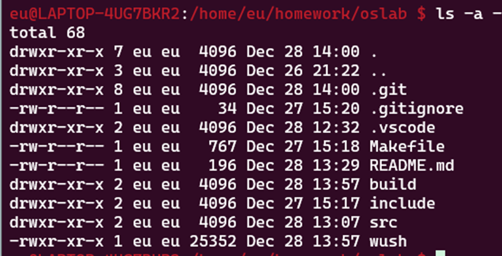

# wush Shell

wush 是一个简单的 Shell 实现，支持基本的命令执行、管道和重定向功能。

## 使用方法

1. 编译 wush：

   ```bash
   make
   ```

2. 运行 wush：

    ```bash
    ./wush
    ```

## 功能展示
### 接受命令
#### 内部命令
本次实验实现了三种内部命令cd,help,exit,如图所示：


#### 外部命令，支持带参数：


### 管道
支持多重管道


### 重定向
支持输入与输出重定向


## 实验关键过程
### 建立整体框架
我将本次实验的shell命名为wush。按照实验指导，整体框架如下：
```c
    do{
        wush_print_prompt();
        line = wush_read_line();
        args = wush_split_line(line);
        status = wush_execute(args);

        free(line);
        free(args);
    }while(status);
```
接下来，我将逐步实现并完善各个函数。

### 实现wush_split_line
由于无法提前知道用户输入的token的数量，于是我的思路是：先申请一定量的空间，当空间不足时，再申请一定量的空间。
而token的分割可以使用strtok()来做。

我首先定义了两个宏，以方便后续修改
#define WUSH_TOKEN_BUFFERSIZE 64
#define WUSH_TOKEN_DELIMITER "\t\r\n\a" // tab,space,enter,bell

代码如下：
```c
char** wush_split_line(char* line)
{
    int bufsize = WUSH_TOKEN_BUFFERSIZE;
    int position = 0;
    char **tokens = malloc(bufsize * sizeof(char*)); 
    char *token;

    // 若申请空间失败，则报错
    if (!tokens) {
        fprintf(stderr, "wush: allocation tokens error\n");
        exit(EXIT_FAILURE);
    }

    // 分割line
    token = strtok(line, WUSH_TOKEN_DELIMITER);
    while (token){
        tokens[position] = token;
        position++;

        // 若超过空间，则重新申请空间
        if (position >= bufsize) {
            bufsize += WUSH_TOKEN_BUFFERSIZE;
            tokens = realloc(tokens, bufsize * sizeof(char*));
            if (!tokens) {
                fprintf(stderr, "wush: allocation tokens error\n");
                exit(EXIT_FAILURE);
            }
        }

        token = strtok(NULL, WUSH_TOKEN_DELIMITER);
    }

    // 循环结束后，最后一个位置置空
    tokens[position] = NULL;

    return tokens;
}
```

### 实现管道命令
这一步我花了很长的时间和精力。原因是我对父子进程、pipe的理解还不够到位。我最后的实现也比较丑陋。

整体思路与实验指导中大致相同，不过多赘述。

这一步中我遇到两大问题：
1. 执行结果不正确

    原因是因为处理管道命令的子进程并没有正常退出。加上exit(EXIT_SUCCESS);即可。

2. 执行一次管道命令后就结束了。

	解决方法是在wush_execute中开了个子进程执行管道命令。
    关键代码如下：
    ``` c
        pid_t wu_pid;
        int wu_status;
        wu_pid = fork();
        if(wu_pid == 0)
        {
            wush_handle_pipe(args);
            exit(EXIT_SUCCESS);
        }
        else if(wu_pid < 0)
        {
            perror("wush");
        }
        else
        {
            do {
                wu_pid = waitpid(wu_pid,&wu_status,WUNTRACED);
            } while(!WIFEXITED(wu_status) && !WIFSIGNALED(wu_status));
        }
        return 1;
    ```

## 参考链接
- [Tutorial - Write a Shell in C • Stephen Brennan](https://brennan.io/2015/01/16/write-a-shell-in-c/)
- [6.2.2 Creating Pipes in C](https://tldp.org/LDP/lpg/node11.html)
- [parthnan/Shell-With-n-Pipe-in-C](https://github.com/parthnan/Shell-With-n-Pipe-in-C)